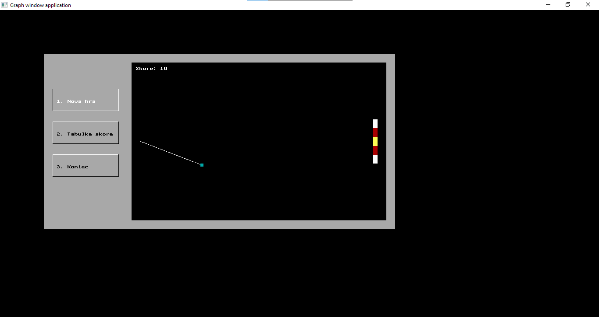

# Arcade Game

This Pascal program features a simple arcade game with multiple functionalities, including a menu system, high-score tracking, and an engaging gameplay experience. The game consists of the following main components:

## Menu System

Players navigate through a menu with three options:

1. **New Game**: Start a new round of the arcade game.
2. **High Scores**: View the top scores achieved in previous games.
3. **Quit**: Exit the game.

## Gameplay

### Terc Shooting

The main gameplay involves shooting at a target called "terc" that moves vertically across the screen. Players aim to hit the terc in specific zones to earn points. The speed of the terc increases as the game progresses.

### Controls

-   **Arrow Keys**: Control the cursor's vertical movement.
-   **Spacebar**: Shoot at the moving terc.

### Scoring

-   Hitting the terc in the central zone earns 10 points.
-   Hitting the terc in the middle zone earns 3 points.
-   Hitting the terc in the outer zone earns 1 point.
-   Missing the terc results in game over.

## High Scores

The program keeps track of the top 5 high scores achieved in the game. The scores are displayed in descending order.

## Screenshots

## Technical Details

-   **Language Used:** Pascal
-   **Dependencies:** Graph and WinCRT units for graphical interface
-   **Implementation:** The game uses a graphical interface to provide an immersive gaming experience with dynamic cursor movement and shooting mechanics.

Feel free to explore the game, set high scores, and enjoy the arcade experience!
